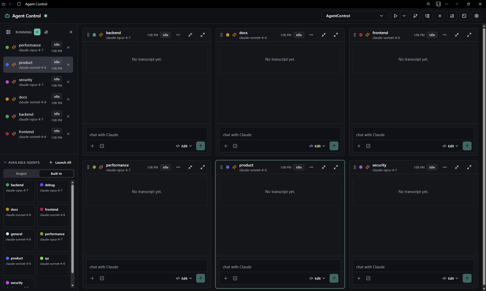

# Agent Control

Agent Control is a local multi-agent dashboard for Claude Code, Codex CLI, and OpenAI API-backed ChatGPT sessions. It lets you add projects, discover project and built-in agent definitions, launch multiple agent sessions, monitor streaming responses and tools, route context between agents, manage plugins, and keep project terminals beside the chats.

The app is built for local development workflows. It starts an Express/WebSocket server, a Vite/React UI, and provider processes/API streams in the selected project folders.



See [CHANGELOG.md](CHANGELOG.md) for a date-grouped history of changes with commit links.

## What It Does

- Launch Claude, Codex, or OpenAI API agents from project agent files or shipped built-in agents such as `general`, `frontend`, `backend`, `security`, and `qa`.
- Run multiple agents as resizable tiles, with minimize-to-header, maximize, drag/drop ordering, configurable tile height, and configurable tile columns.
- Switch between projects. Each project keeps its own open agents and terminal sessions.
- Open the current project folder from the top bar in Explorer/Finder/xdg-open.
- See provider icons, model, status, and last activity in the left nav and chat headers.
- Stream Claude responses from `--output-format stream-json`, including live assistant text, thinking timers, token usage when the provider reports it, simplified tool activity, and a raw stream view for diagnostics.
- Stream OpenAI Responses API sessions and run Codex CLI sessions through the provider selector.
- Show prominent permission prompts for gated Claude tools, then send Approve/Deny back to the running Claude process. Normal tool prompts can be remembered as model-specific always-allow rules that you can review and remove in Settings.
- Show Claude clarification questions with tabbed selectable answers, including an Other response, then send the chosen answers back to the session.
- Show Claude plan-mode results as formatted plan cards, with options to approve and build in the same chat, delegate the approved plan to another agent, deny, keep planning, or send a custom response.
- After approving a plan, show small optional next-step suggestions based on available project agents first, then built-in agents. You can dismiss them, check them off, or launch/reuse a matching agent for QA, security, docs, performance, or product follow-up.
- While an approved plan is being executed in the current chat, show a muted `Executing Phase X` label above the thinking/streaming indicator.
- Control mode per agent: Ask before edits, Edit automatically, Plan mode, or Bypass permissions.
- Control effort per agent: low, medium, high, xhigh, or max.
- Toggle Claude thinking for a session.
- Use provider-aware slash command autocomplete from AgentControl commands, Claude built-ins, project commands, user commands, plugin commands, and session-reported commands. Commands that require the Claude TUI are shown disabled.
- Add context from local files, drag/drop files into chat, paste images, and send selected transcript text to another agent.
- Run project terminals with tabs, command history, rename, split panes, resize, pop out, dock left/right/bottom/float, and kill-on-close behavior.
- Show Git status for the selected project, including changed files, unpushed commit count, and a Push action.
- Browse, install, enable, and persist Claude/Codex plugins per agent definition when the provider exposes a local plugin catalog.
- Export/import dashboard config and export chats as Markdown, JSON, or raw Claude stream JSONL.
- Use light, dark, or automatic color mode.
- Start, restart, or shut down the Agent Control dev stack from the UI when running in supervised mode.

## Technology

This is a TypeScript workspace with three packages:

- `server`: Express 4, `ws`, `node-pty`, `qrcode`, `gray-matter`, provider process management, and API streaming.
- `web`: React 19, Vite 6, Zustand, Radix UI primitives, Tailwind CSS, Lucide icons, and xterm.js.
- `shared`: shared TypeScript protocol and data types.

Runtime requirements:

- Node.js 20 or newer.
- npm.
- Claude Code CLI available on `PATH`, configured in Settings, or configured with `CLAUDE_CODE_CLI`.
- Codex CLI available on `PATH`, configured in Settings, or configured with `CODEX_CLI`, if you want Codex sessions.
- `OPENAI_API_KEY`, if you want OpenAI API sessions.
- `ANTHROPIC_API_KEY`, if you want Claude Code API-key auth instead of interactive Claude auth.
- Git, if you want Git status/push integration.
- Git for Windows is recommended on native Windows so Claude Code can use Bash tools; otherwise Claude Code may fall back to PowerShell.

## Install Claude Code

Install Claude Code using Anthropic's official instructions: https://code.claude.com/docs/en/quickstart

Common current options include:

```powershell
# Windows PowerShell
irm https://claude.ai/install.ps1 | iex
```

```bash
# macOS, Linux, or WSL
curl -fsSL https://claude.ai/install.sh | bash
```

You can also use package managers such as Homebrew or WinGet when appropriate. After installing, verify that Agent Control can find it:

```bash
claude --version
```

On Windows, verify from the same shell you will use to start Agent Control:

```powershell
where.exe claude
where.exe claude.cmd
claude --version
```

If `claude` is not on `PATH`, set:

```powershell
$env:CLAUDE_CODE_CLI="C:\path\to\claude.exe"
```

```bash
export CLAUDE_CODE_CLI="/path/to/claude"
```

## Authenticate Claude

Agent Control uses your existing Claude Code authentication. Authenticate in a normal terminal before launching agents:

```bash
claude auth login
claude auth status --text
```

You can also run `claude` interactively and use `/login` if prompted.

Claude Code supports several auth methods, including Claude.ai subscription login, Claude Console/API credentials, and enterprise cloud providers. Standard Agent Control agents can use whatever Claude Code can use in your terminal environment. See Anthropic's auth reference for current details: https://code.claude.com/docs/en/authentication

Remote Control is temporarily unavailable in Agent Control. Claude Code can start `claude remote-control`, but Agent Control cannot reliably mirror the live chat transcript from the current CLI. Use claude.ai/code or the Claude mobile app directly for Remote Control sessions until Claude exposes more CLI control.

Agent Control requests the selected Claude model on launch. If Claude later reports a different model in stream metadata, Agent Control keeps the selected model visible and adds a system note so you can inspect the raw stream and investigate the mismatch.

## Install Codex CLI

Install OpenAI Codex CLI with npm:

```bash
npm install -g @openai/codex@latest
```

Then verify it from the same shell you will use to start Agent Control:

```bash
codex --version
codex login
```

On Windows, also check where the command resolves:

```powershell
where.exe codex
where.exe codex.cmd
codex --version
```

If `codex` is not on `PATH`, set:

```powershell
$env:CODEX_CLI="C:\path\to\codex.exe"
```

```bash
export CODEX_CLI="/path/to/codex"
```

Codex CLI can also be installed from the OpenAI Codex GitHub releases if you prefer a platform binary: https://github.com/openai/codex

## Windows And WSL Provider CLIs

Windows and WSL use separate command environments. If you add a WSL project, install and authenticate the provider CLI inside that WSL distro too. A Windows `claude.exe` or `codex.exe` does not automatically make `claude` or `codex` available inside WSL.

Verify WSL commands from PowerShell:

```powershell
wsl.exe -l -v
wsl.exe -d Ubuntu --exec sh -lc 'command -v claude; claude --version'
wsl.exe -d Ubuntu --exec sh -lc 'command -v codex; codex --version'
```

Replace `Ubuntu` with the distro shown in Agent Control. If a command is missing, open that distro and install it there:

```bash
npm install -g @openai/codex@latest
codex login
```

For Claude Code in WSL, use Anthropic's Linux install command from the Claude Code quickstart, then run:

```bash
claude auth login
```

## Install Agent Control

```bash
npm install
```

## Run In Development

```bash
npm run dev
```

This starts:

- Server/API/WebSocket: http://localhost:4317
- Vite web app: http://localhost:4318

For the best everyday experience, install Agent Control as a browser app from your browser's address bar or app menu after opening the local URL. This gives it its own window, keeps terminals and popouts feeling app-like, and avoids losing the dashboard among regular browser tabs.

The Vite app proxies API and WebSocket traffic to the server. The server binds to `127.0.0.1` by default and protects API/WebSocket control traffic with a per-process local token. The top-bar connection dot is green when connected and red when disconnected. Use `HOST`, `PORT`, `AGENTCONTROL_AUTH_TOKEN`, and `AGENTCONTROL_ALLOWED_ORIGINS` only when you intentionally need a different local setup.

For UI-controlled restart/shutdown, run supervised mode instead:

```bash
npm run dev:supervised
```

When supervised mode is active, the connection-dot menu can restart or shut down Agent Control.

## Production Build

```bash
npm start
```

`npm start` builds the workspace first, then starts the Express server. In production, there is no separate Vite web process: the Express server serves the built React app from `web/dist` at http://localhost:4317.

If you already built the app and only want to start the server, use:

```bash
npm run start:server
```

## Projects

Add a project from the project menu in the top bar. The folder selector can browse your home folder, configured project roots, existing project folders, and configured agent directories; you can also paste a path manually. The folder icon next to the project controls opens the selected project in the system file manager.

Project behavior:

- The selected project controls which agents and terminals are visible.
- Closing a project closes that project's agents and terminals.
- If a project has no project agent files, Agent Control shows a message and defaults the Available Agents panel to Built-In agents.
- Worktree projects are indented under their parent project in the selector.
- Project paths are persisted in `~/.agent-dashboard/config.json`.

## Agent Definitions

Project agent files are discovered from the provider-specific agent directory for the selected project. By default those are `.claude/agents`, `.codex/agents`, and `.agent-control/openai-agents`. Worktree projects inherit project agents from the root project folder, so local agent definitions remain visible when switching into a worktree.

Built-in agent files ship with the repo in `.agent-control/built-in-agents`. They are app-level defaults, not project files. You can add, edit, remove, recolor, or point to a different built-in agent directory from Settings.

Each Markdown agent file becomes an available agent tile.

Example:

```yaml
---
name: Reviewer
description: Reviews code changes and suggests fixes
color: hsl(180 65% 55%)
defaultModel: claude-sonnet-4-6
tools:
  - Read
  - Bash
plugins:
  - frontend-design@claude-plugins-official
---

You are a careful code reviewer. Focus on correctness, security, and tests.
```

Supported frontmatter:

- `name`: display name and launch type.
- `description`: shown in the launch/available-agent UI.
- `color`: tile/nav accent color. If omitted, a stable color is generated.
- `defaultModel`, `default_model`, or `model`: selected by default when launching.
- `tools`: metadata for the agent definition.
- `plugins`: plugin IDs selected by default for that agent.

The Markdown body is used as the agent system prompt. The launch modal includes a "view agent file" link so you can inspect the full prompt and open the actual file in your default editor/file handler; edit the agents file to change it.

## Launching Agents

Use the `+` button next to Running or click an Available Agent tile. The Available Agents panel has Project and Built-In tabs; Project agents appear first when present, and duplicate agent names are disambiguated by source.

Launch options include:

- Agent type.
- Display name.
- Model.
- Initial prompt.
- Selected plugins.

New agents are selected after launch and focus moves to the chat box. "Launch All" starts every available definition with its default model, default plugins, and app default mode.

## Modes, Permissions, Thinking, And Effort

The composer includes provider-aware mode controls. Claude CLI/API sessions expose Claude-style modes:

- Ask before edits: Claude asks before making edits.
- Edit automatically: Claude can edit selected text or files with fewer prompts.
- Plan mode: Claude explores and proposes a plan before editing.
- Bypass permissions: Claude will not ask before potentially dangerous commands.

The app also exposes provider-specific equivalents where available:

- Thinking toggle for Claude.
- Codex-oriented speed/intelligence style choices when supported by the selected Codex runtime.
- OpenAI deep-research oriented options when using deep-research models.
- Effort selector: low, medium, high, xhigh, max.

Changing mode, thinking, or effort updates the running session immediately when Claude supports it. If a change requires a session restart, Agent Control applies it after the active turn.

## Permission Prompts

Standard agents launch Claude with a small AgentControl MCP permission tool:

- Claude emits a permission-gated tool request.
- Agent Control marks the matching tool card as awaiting permission.
- The agent status changes to `awaiting-permission`.
- Approve/Deny sends the decision back to the running Claude process.

This is used for gated write/edit/tool calls in modes that require approval.

The helper retries permission callbacks across common local hostnames so WSL and native Windows launches can still reach the Agent Control backend when `127.0.0.1` resolves differently inside the provider process.

## Plans And Questions

Claude clarification questions and plan-mode prompts are rendered as first-class chat cards instead of raw tool output.

Question cards:

- Show one question at a time in a tabbed interface.
- Advance automatically after single-choice answers.
- Support multi-select questions.
- Support an Other option with custom text.

Plan cards:

- Render Markdown plans as normal chat content with a popout button.
- Offer Approve and build here, Deny, Keep planning, and Other.
- Offer Approve and launch agent, which starts a new project or built-in agent with the approved plan as its initial prompt and tells the planning chat not to implement it there.
- Hide the handled plan/question tool plumbing from the main chat.

## Chat And Transcript UX

- Enter sends the message.
- The send button becomes Stop while Claude is active.
- Queued messages can be expanded, edited, deleted, and reordered before they are sent.
- Tool output is summarized as one-line activity in normal chat view; use the agent menu's View Raw Stream option for provider JSONL and detailed tool payloads.
- Long questions and responses can collapse/expand.
- Streaming output auto-scrolls.
- Last sent message can pin while scrolling; clicking the pinned message jumps back to the original message, and long pinned messages can expand/collapse.
- Long chat responses include popout and expand/collapse controls when needed.
- Right-click selected text to copy or send it to another agent. If nothing is selected, the current message/tool card under the pointer is used; outside a block, the whole chat is used.
- Long chat blocks include a popout button. The popout supports Markdown view, raw-text view, copy, and send-to-agent, including selected text.
- Clear Chat clears only the transcript. Close Chat exits the agent and removes the tile.
- Exit All closes all agents for the current project after confirmation.

## Attachments And Context

The `+` button in the composer supports:

- Upload from computer.
- Add context from the current project.

Add Context shows folders and files from the repo. Folders expand so you can choose individual files. Text-like context files are included in the prompt payload with a size cap; images are sent as image content when supported by Claude.

You can also drag/drop files into chat or paste images.

## Slash Commands

Slash command autocomplete merges several sources:

- AgentControl-native commands such as `/clear`, `/exit`, `/status`, `/stop`, and `/interrupt`.
- Claude built-ins where they work in non-interactive stream-json mode.
- Project commands from `.claude/commands`.
- User commands from Claude's user command directories.
- Plugin commands and skills.
- Session-reported commands from Claude.

Commands known to require the Claude TUI, such as login/config-style commands, are shown disabled instead of being passed through and failing in the dashboard.

## Plugins And MCP

Provider plugin support is shown in the relevant Settings tab and in the launch flow. The plugin UI can:

- Show installed, enabled, and available plugins.
- Browse plugin marketplaces.
- Add a marketplace by GitHub repo, URL, or local path where supported.
- Install plugins.
- Enable plugins.

Agent definitions can persist selected plugin IDs in their frontmatter. On launch, Agent Control attempts to ensure selected plugins are enabled before starting the session. Claude and Codex plugin catalogs are shown when the local CLI exposes them; OpenAI API sessions do not expose a local plugin catalog. Running sessions can also show active plugins, MCP servers, and available tools when the provider reports them.

## Remote Control

Remote Control is intentionally hidden from the launch flow for now.

Claude Code can start `claude remote-control --name <agent name> --spawn session`, but the local CLI currently does not provide stable bidirectional transcript/input control for Agent Control. Agent Control can start a usable session, but it cannot reliably show the chat, so new Remote Control launches are disabled until Claude exposes more complete CLI control.

## Terminals

The terminal panel uses `node-pty` on the server and xterm.js in the browser.

Features:

- One or more terminal tabs per project.
- Real shell input, command history, and resize.
- Rename tabs.
- Split panes.
- Dock bottom, left, right, or float.
- Pop out to a separate browser window and dock back.
- Collapsed terminal stream shows the last output line from the last active session.
- Closing a terminal kills whatever is running in it.

Terminal history is stored per project under `~/.agent-dashboard/terminal-history`.

## Git Menu

The Git button shows:

- Current branch/upstream.
- Changed files.
- Ahead/behind counts.
- A badge for unpushed commits.
- Push button when commits are ahead of upstream.

Git operations run in the selected project's folder.

## Git Worktrees

The Worktrees button next to the Git menu opens a tabbed worktree view for the selected repository:

- List all worktrees for the repo and switch to any worktree already open as a project.
- Open and switch to unopened worktrees that are descendants of the current project folder.
- Create a new worktree from a branch/base ref; created worktrees are added to Agent Control as projects automatically.
- Use the default sibling worktree folder pattern `<project>-worktrees/<branch>`, with the resolved path shown before creation.
- Optionally copy local agent files into the worktree when those project agent files are untracked.
- Merge another worktree's branch into the current project when the current project is clean.
- Remove or close non-current worktree tabs; related agents and terminals are closed if that worktree was open as a project.

## Settings And Stored Data

Settings use a left navigation and wider right-side content area. Save stays visible, is disabled until something changes, and Cancel discards unsaved edits.

Settings include:

- General configuration, including project folders, built-in agent directory, config export/import, app paths, and theme.
- Provider-specific tabs for Claude, Codex, and OpenAI.
- Provider model lists with "Get Current Models" for the active provider.
- Claude runtime selection: Claude CLI or Anthropic API.
- Claude, Codex, Git, and agent directory paths.
- Built-in agent management.
- Default mode for new agents.
- Auto-approve tool use behavior.
- Tile height and columns.
- Sidebar width.
- Show last message pinned.

Stored local files:

- `.agent-control/built-in-agents`: built-in agents shipped with the repo.
- `~/.agent-dashboard/config.json`: app settings and project paths.
- `~/.agent-dashboard/secrets.json`: optional locally saved Anthropic/OpenAI API keys. This file is not included in settings export.
- `~/.agent-dashboard/state.json`: persisted agents and recent transcripts.
- `~/.agent-dashboard/attachments`: uploaded/pasted attachments.
- `~/.agent-dashboard/terminal-history`: shell history per project.
- `~/.agent-dashboard/mcp`: generated MCP config for AgentControl permission prompts.
- `~/.claude`: Claude Code credentials, settings, plugins, and command files managed by Claude Code.

## Environment Variables

- `PORT`: server port. Defaults to `4317`.
- `CLAUDE_CODE_CLI`: path to the Claude Code CLI executable or shim.
- `CODEX_CLI`: path to the Codex CLI executable or shim.
- `OPENAI_API_KEY`: OpenAI API key used by OpenAI API sessions and Codex where applicable.
- `ANTHROPIC_API_KEY`: Anthropic API key available to Claude Code.
- `GIT_PATH`: path to the Git executable.
- `PROJECTS_ROOT`: fallback projects root used before projects are added manually. Defaults to `~/projects`.
- `FORCE_FALLBACK_MODEL_SWITCH=1`: forces resume-based model switching for testing.
- `AGENT_CONTROL_SHELL`: shell used for embedded terminals.
- `AGENTCONTROL_PERMISSION_URL`: override the permission callback URL used by the permission MCP helper.

## Security Notes

Agent Control is a powerful local tool. It can launch Claude Code, run shells, read selected project files as context, install plugins, push Git commits, and stop/restart its own dev server.

Use it on a trusted machine and avoid exposing port `4317` to a network. The development server is intended for localhost use. Be careful with Bypass permissions, plugin marketplaces, uploaded attachments, and projects that contain secrets.

## Troubleshooting

Claude CLI not found:

- Run `claude --version`.
- Make sure the Claude Code install directory is on `PATH`.
- Set `CLAUDE_CODE_CLI` to the full executable path.

Not authenticated:

- Run `claude auth login`.
- Check `claude auth status --text`.
- If an old `ANTHROPIC_API_KEY` is taking precedence, unset it or adjust your Claude Code auth settings.

Remote Control unavailable:

- This is expected. Remote Control is temporarily hidden and blocked in Agent Control because the dashboard cannot reliably mirror the chat transcript from the current Claude CLI.
- Use claude.ai/code or the Claude mobile app directly for Remote Control sessions.

No streaming text:

- Export Raw Stream from the agent menu and inspect whether Claude is emitting text deltas or only tool activity.
- Tool-heavy responses may show Bash/tool cards before assistant text arrives.

Plugin appears missing after install:

- Refresh the plugin picker or the provider's Settings tab.
- Confirm the exact plugin ID, including marketplace suffix, matches the ID in the agent file.
- Run `claude plugin list --available --json` in a terminal if Claude's plugin catalog looks stale.

Open project folder does nothing:

- Restart Agent Control after updating, because the folder opener lives in the backend server.
- On Windows, Agent Control opens folders through `explorer.exe`; if Explorer is blocked by policy or another process is intercepting folders, test with `explorer.exe <project path>` from PowerShell.
